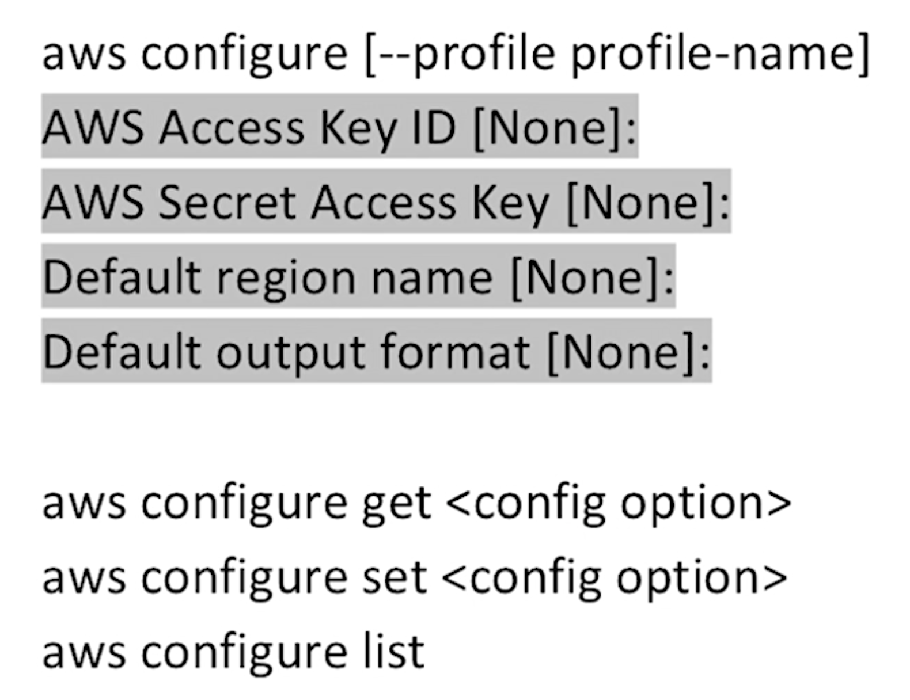
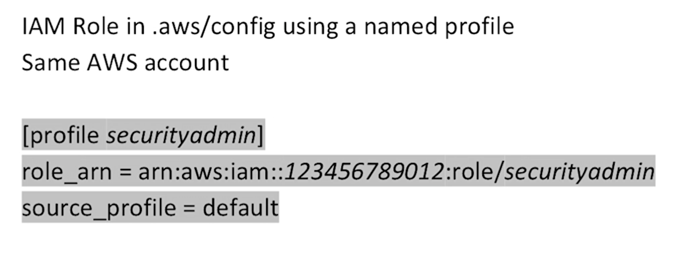
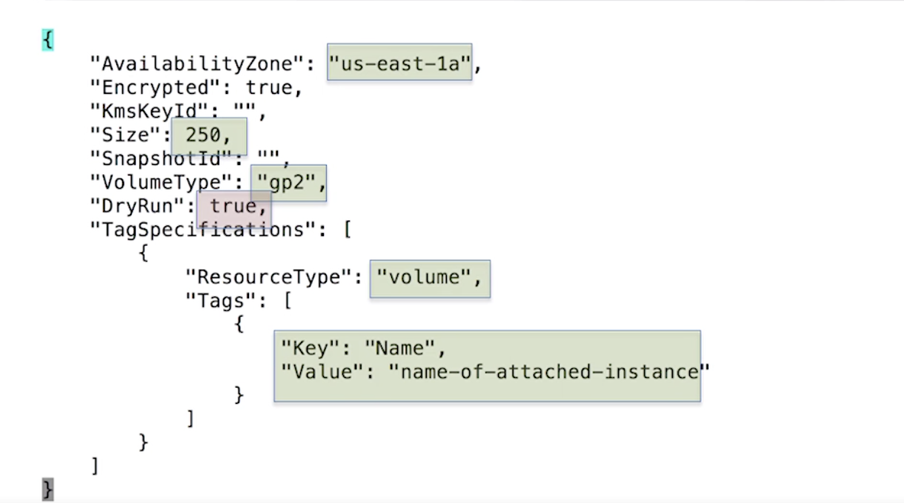
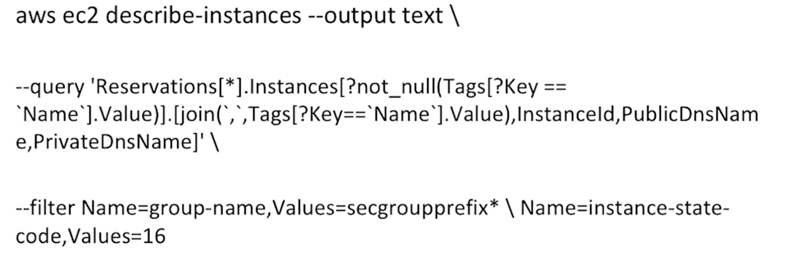
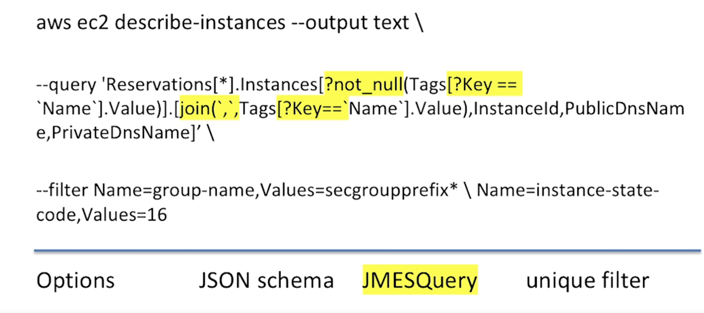
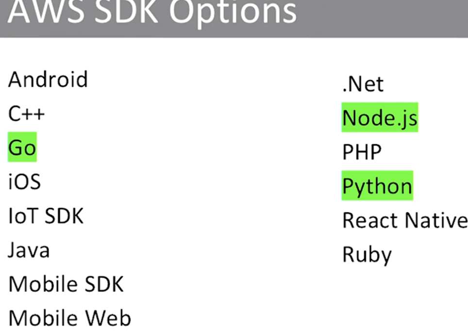
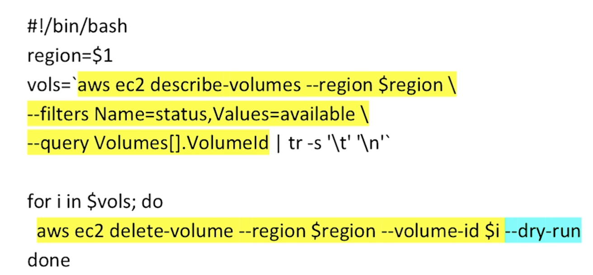
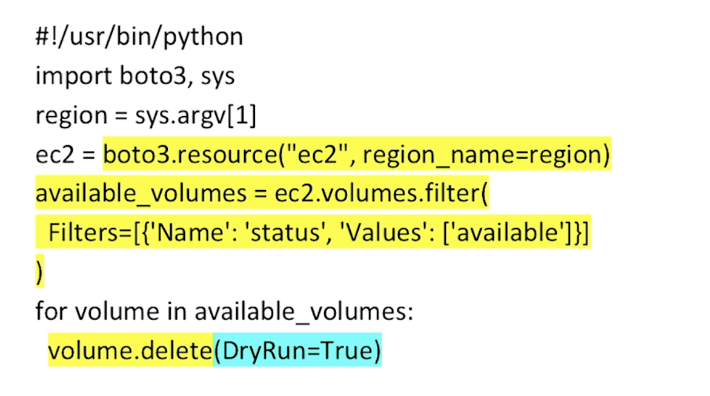
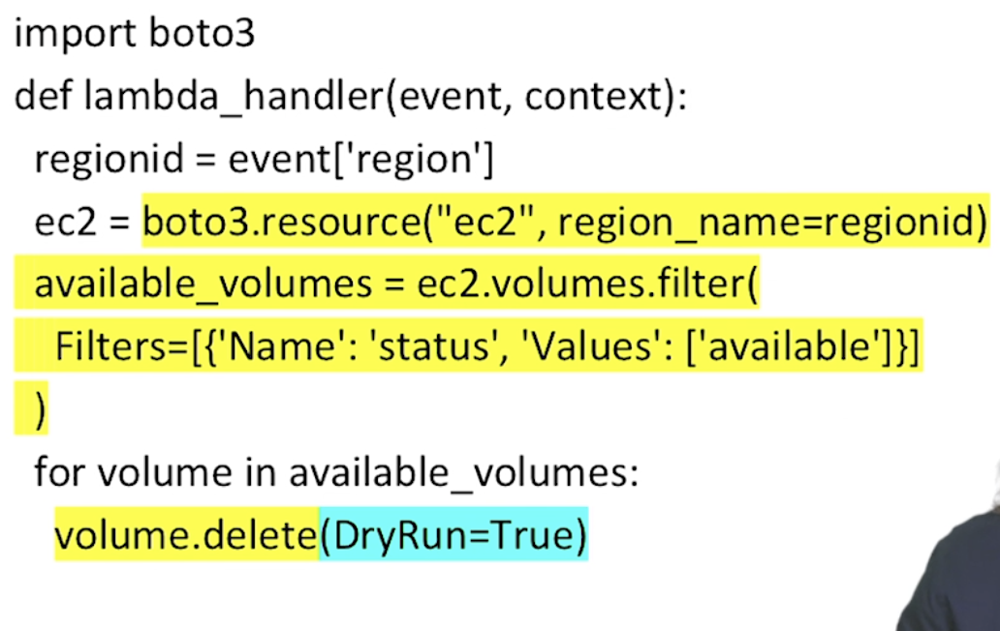
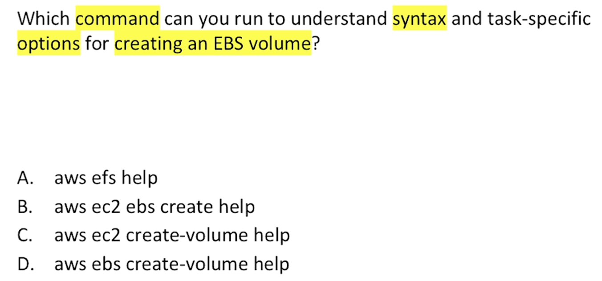

# AWS SYSOPS 


# Navigation  

[CLI](#CLI)  
[SKD](#SDK)  

# CLI 

## Install  

```
pip install awscli
```

```
curl "https....
``` 

## CLI Configuration   
  
    

  
  


## CLI Generate Skeleton 

- Run any AWS command followed by --generate-cli-skeleton 
- Modify json file as appropriate 
- Execute command to create resource 
  
Example:  

```
aws ec2 create-volume --generate-cli-skeleton > myspec.json

```  
  
   
 
  
### Important   
  
This gives the opportunity to test before run.  
  
`"DryRun": true,` 
  
    
## Skeleton Execute. 
  
```
aws ec2 create-volume --cli-input-json file://volcreate.json
```

## Chaining output as input to next command 
  
`--query`  
  
- restrict input to the structure 
- supports path expressions 

## filter 

`--filter`
   
- restricts output/response to specific objects 
  
    
## CLI EXAMPLE 
    
Requirements   
- provide info on ec2
- correspond wiht security group 
- non null nametag
- running state 
  
  
```Shell
aws ec2 describe-instances --output text\
```  
  
- output text is assumption 
  
  
  
### JMES query part 
  
  
    
## Filter  
It has an and term so its two independent matchings groupname must have secgroup prexix and instance state must equal 16.   
16 means running.  

match security group prefix  
match all running instnaces  
match instances with name tag of non null values  
return name tag value, instance id, public dns name and ..  
  
This could be a single command run on a daily basis to get inventory information,    
in different regions.  
that could be stored in a database to view the changes in infrastructure over time. 

# SDK
  
  
  
Certification is more interested in the CLI than the details of the software development kits SDK.  
  
## CLI  
- Text query. 

## SDK
  
- Works with objects 
- you always have results sets (so you don't need to do queries)  
- This means you chose what results to work with .  
  
## Comparison    
  
Test to check EBS volumes within region,   
status = available.   
Then we can delete to save money.  

  
  
fitler for name available 
query restricts output so we only return volume id   
  
If you have multiple vols created with status = available at the same time   
**they will show up on the same line**.  
So in the query command we use `tr -s '\t' '\n'`. to convert tabs in carriage returns 
  
final part is to execute script   
  
### Using Python on SDK  
  
- note we use the `boto3` lib 
- Note no query as not needed with SDK. 
   
  
- remove dryrun=true when running for real. 

## As a lambda function for serverless. 
  
- we could paste this in as a trigger to run on a daily basis.  
- slightly different from previous example. 
  


# CLI - QUESTION  
  
  
  
anser = c


```python

```
